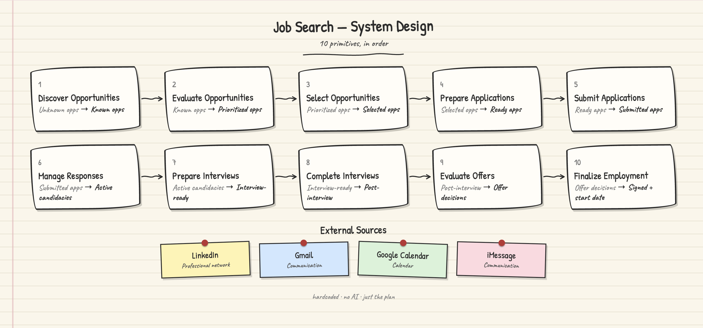

# GenericSystemDesign

A reusable framework for modeling any process as a system: a problem statement, a chain of primitives (atomic transformation steps), and the datasources that feed them.

## Structure

- **`problemstatement.yaml`** — defines the system in the universal form: *[who] needs a way to [do something] because [limitation], resulting in [consequence]*.
- **`primitives/`** — the ordered, atomic steps that move the system from problem to resolved state. Each primitive specifies its Problem, Input, Transformation, Output, and Exit Condition.
- **`datasources/`** — the external inputs (e.g. email, calendar, messaging, professional network) that supply data to the primitives.
- **`diagram/`** — a visual, browser-viewable rendering of the system (`open.sh` to launch it).

## Example: Job Search

The current instance models a job search as a 10-step pipeline:

1. Discover opportunities
2. Evaluate opportunities
3. Select opportunities
4. Prepare applications
5. Submit applications
6. Manage responses
7. Prepare interviews
8. Complete interviews
9. Evaluate offers
10. Finalize employment

Each step is defined as a primitive with a clear input/output contract, so the pipeline can be automated or reasoned about stage by stage.
